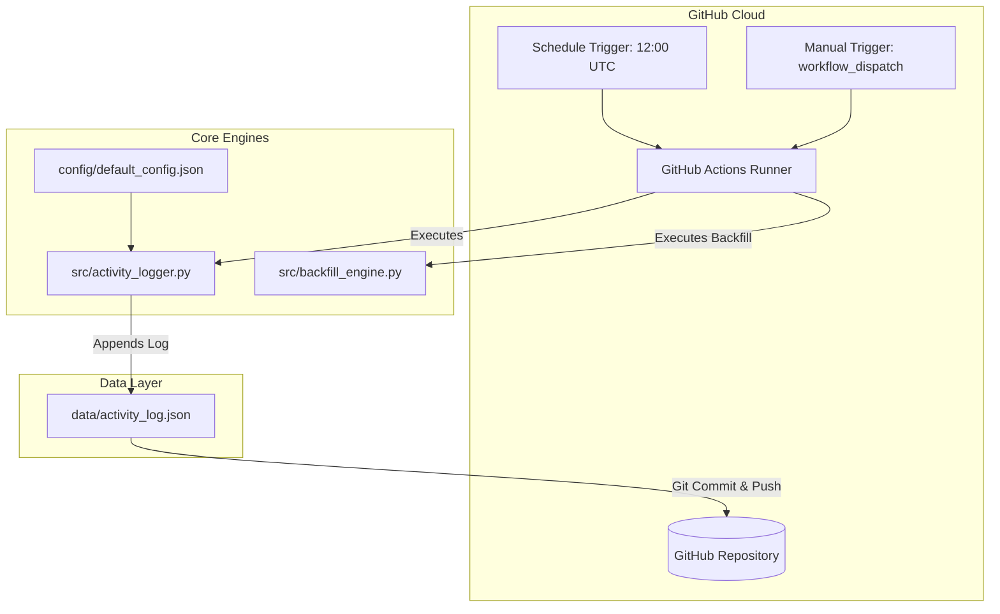

# System Architecture & Technical Design

This document details the architectural layout, core components, and operational flow of the **GitHub Contribution & Activity Automation** project.

---

## 🏛️ High-Level Architecture



---

## 📁 Directory Structure Overview

```
.
├── .github/
│   └── workflows/
│       ├── daily-activity.yml       # Production automated daily update workflow
│       ├── backfill-history.yml     # Interactive past contribution backfill workflow
│       └── auto-activity.yml        # Lightweight direct script alternative
├── config/
│   └── default_config.json          # System settings & commit message templates
├── data/
│   └── activity_log.json            # Structured JSON telemetry log file
├── docs/
│   ├── ARCHITECTURE.md              # Technical design document (this file)
│   └── SETUP_GUIDE.md               # End-to-end setup guide
├── scripts/
│   ├── run_local.bat                # Windows quickstart launcher
│   └── run_local.sh                 # Linux / macOS quickstart launcher
├── src/
│   ├── __init__.py                  # Package marker
│   ├── activity_logger.py           # Daily activity logger engine
│   └── backfill_engine.py           # Historical backfill engine
├── .gitignore                       # Repository ignore rules
├── CONTRIBUTING.md                  # Developer & contributor guidelines
├── LICENSE                          # MIT License
└── README.md                        # Primary documentation & quickstart
```

---

## ⚙️ Core Components

### 1. Daily Activity Logger (`src/activity_logger.py`)
- Reads configuration from `config/default_config.json`.
- Appends structured telemetry entries to `data/activity_log.json`.
- Configures git user identity and commits the log file update.

### 2. Historical Backfill Engine (`src/backfill_engine.py`)
- Accepts parameter inputs (`--days`, `--min-commits`, `--max-commits`, `--email`).
- Generates historical git commits with explicit `GIT_AUTHOR_DATE` and `GIT_COMMITTER_DATE` environment variables to backfill contribution history.

### 3. Workflows (`.github/workflows/`)
- `daily-activity.yml`: Standard scheduled workflow running daily at `12:00 UTC`.
- `backfill-history.yml`: Parameterized GitHub Actions workflow allowing users to backfill directly from GitHub web interface.

---

## 🔐 Security & Identity Attribution

- **Permissions**: Workflows explicitly set `permissions: contents: write` to allow pushing commits back to the default branch.
- **Privacy & Secrets**: Sensitive values (such as primary email addresses) can be stored in GitHub Repository Secrets (`USER_EMAIL`).
